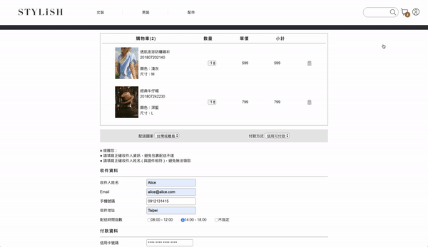
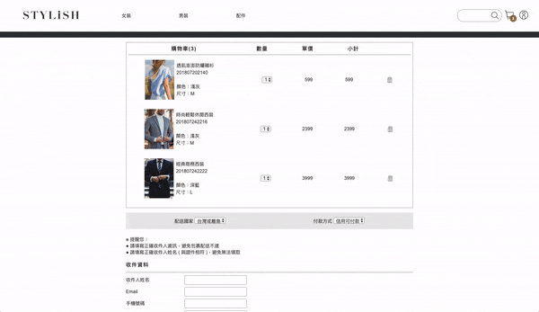

# Stylish E-Commerce

**Boutique Fashion E-Commerce Website**

A mobile-friendly e-commerce website, featuring complete checkout system integrated with TapPay’s payment SDK and Facebook Login for membership management.

## Demo

Website: [https://this-ting.github.io/stylish-ecommerce/html/](https://this-ting.github.io/stylish-ecommerce/html/)

## Key Features

### Shopping cart synchronous with backend stock inventory

Product quantity selection will display up to the current backend stock inventory

### Checkout Payment System Intergration

Integrated with TapPay Direct Pay SDK for credit card payment and provide user with order confirmation number

### Infinite Scroll

### RWD

## Built with

### Programming Language

-   JavaScript
-   HTML, CSS

### Layout

-   RWD
-   CSS Flexbox

### Libraries

-   [TapPay Direct Pay SDK](https://docs.tappaysdk.com/tutorial/en/home.html#home) - Intergrated payment system
-   [Facebook Login](https://developers.facebook.com/docs/facebook-login/web/)

## Author

Ting Chang

-   GitHub: [@this-ting](https://github.com/this-ting)
